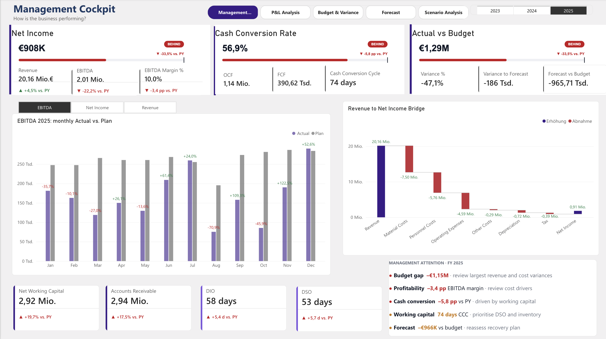
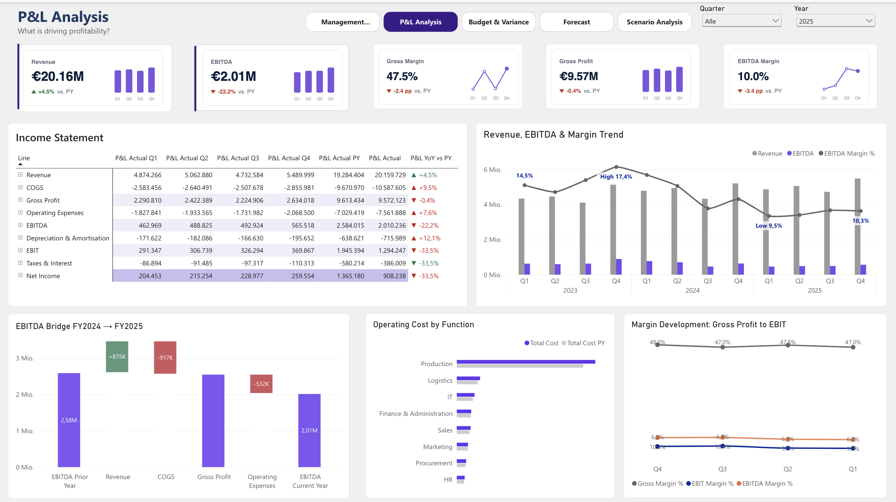
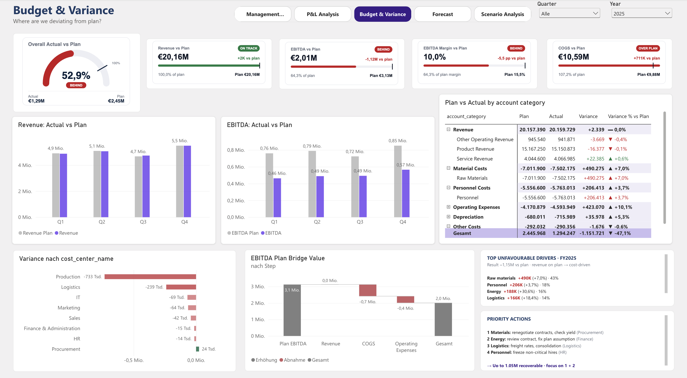
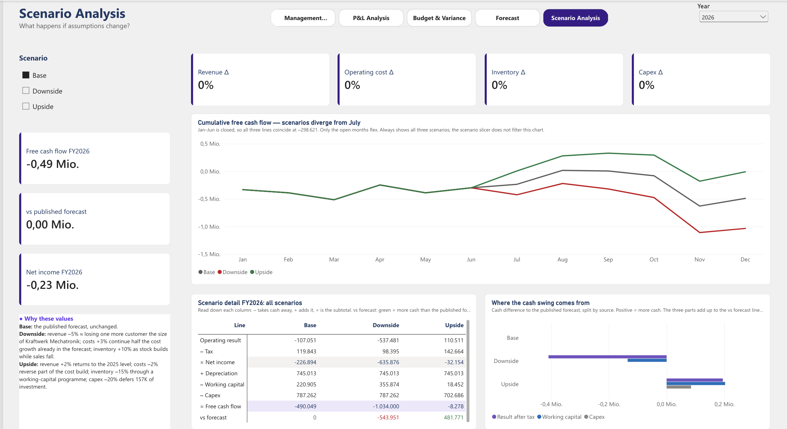

# AlpenTech Controlling – Power BI Financial Reporting

A five-page controlling report in Power BI for **AlpenTech GmbH**, a fictional German industrial B2B
manufacturer, covering FY2023–2025 in full and FY2026 as an open year (actuals to June, forecast to December).
Built as a portfolio project for working-student roles in **Controlling / FP&A**.



## Highlights

- **5 report pages**, each answering one controlling question, from the management summary down to scenario analysis
- **Plan vs. actual vs. forecast** with variance bridges, prior-year comparison and forecast accuracy
- **Beyond the P&L:** cash conversion, free cash flow and working capital (DSO, DIO, cash conversion cycle)
- **Star schema** with 7 dimensions and 7 fact tables, plus a disconnected layout table for the income statement
- **Documented decisions:** every non-obvious definition (COGS, forecast accuracy, targets) is justified in
  [`docs/DECISIONS_LOG.md`](docs/DECISIONS_LOG.md)
- **Tools:** Power BI Desktop, DAX, Power Query, TMDL · Python and JavaScript for the data

## Report pages

### 1. Management Cockpit – *How is the business performing?*

*(Screenshot at the top.)*

- Three headline KPIs with status and target: **Net Income**, **Cash Conversion Rate**, **Actual vs. Plan**
- Monthly EBITDA, Net Income or Revenue against plan, switchable with one button row
- Revenue-to-net-income bridge, working capital cards (NWC, receivables, DIO, DSO) and a management attention list

### 2. P&L Analysis – *What is driving profitability?*



- Income statement from revenue to net income, by quarter and against prior year
- EBITDA bridge FY2024 → FY2025: revenue growth of +875K was more than absorbed by COGS (−917K)
- Margin trend over 12 quarters and operating cost by function

### 3. Budget & Variance – *Where are we deviating from plan?*



- Plan attainment gauge and KPI cards with on-track / behind status
- Plan vs. actual by account category and by cost center
- EBITDA plan bridge, the top unfavourable cost drivers and prioritised actions

### 4. Forecast – *Where will we land in 2026?*

<!-- Screenshot to add: screenshots/04_forecast.png -->

- Mid-year outlook for FY2026: six closed months plus a six-month forecast
- Plan vs. forecast gap split into cost trend and customer loss
- Forecast accuracy of prior years, measured on the forecast months only

### 5. Scenario Analysis – *What happens if assumptions change?*



- Three fixed scenarios (Base, Downside, Upside), each with assumptions anchored in the data
- Cumulative free cash flow per scenario: closed months stay fixed, only July–December moves
- Scenario detail from operating result to free cash flow, and where the cash difference comes from

## Key findings

**FY2025**

- **Revenue on plan, profit not.** Revenue of €20.16M hit plan (+0.0%) and grew 4.5%, but EBITDA ended
  €1.12M below plan and 22.2% below prior year. The gap is cost-driven.
- **Raw materials are the largest driver:** +€490K over plan, 43% of the unfavourable cost variance.
- **Margins are eroding:** gross margin fell from 50.9% (2023) to 49.9% to 47.5%. In 2025 gross profit
  fell in absolute terms while revenue grew.
- **Profit is not turning into cash:** €2.0M EBITDA became €391K free cash flow. Net working capital grew
  19.7% against 4.5% revenue growth; customers pay ten days later than in 2023.

**FY2026 outlook** (as of 30 June 2026)

- **Operating result forecast at −€107K against a plan of +€2.72M**, the first loss in the dataset.
- **About one third of the gap is the loss of the largest customer** (25.6% of 2025 revenue, net effect −€777K
  from October). **Two thirds is the cost trend:** logistics, IT and energy have outgrown revenue for three years.
- **The forecast is likely optimistic.** The mid-year forecast overestimated the result in each of the last
  three years, so −€107K is the better end of the range, not its midpoint.

Full write-up: [`docs/FORECAST_2026_SUMMARY.md`](docs/FORECAST_2026_SUMMARY.md)

## Data model

Star schema, one company, monthly and transaction grain.

| Type | Tables |
|---|---|
| Dimensions | `dim_date`, `dim_company`, `dim_business_unit`, `dim_cost_center`, `dim_account`, `dim_customer`, `dim_product` |
| Facts – P&L | `fact_actual` (transactions), `fact_budget`, `fact_forecast` (cost center × account × month) |
| Facts – cash & tax | `fact_working_capital`, `fact_capex`, `fact_tax` |
| Facts – forecast | `fact_forecast_events` (the two known FY2026 events) |
| Layout | `PnL_Layout`, a disconnected table that drives the income statement rows |

**Sign convention:** revenue is positive, costs are negative, so `SUM(amount)` is the operating result.
Signs are flipped for display inside measures only, never in Power Query.

<!-- Screenshot to add: screenshots/data_model.png (Model view) -->

Field-level reference: [`docs/DATA_DICTIONARY.md`](docs/DATA_DICTIONARY.md)

## DAX highlights

- **Variance % that can't flip sign.** Every variance divides by `ABS()` of the base. Without it, energy
  costs 30.6% over plan show as +30.6%, a favourable-looking overrun.
- **Honest forecast accuracy.** January–June forecast equals actual by construction, so forecast error is
  measured on July–December only, using `KEEPFILTERS` so it still intersects with the user's date selection.
  For 2024 this changes the error from −8.5% to −18.9%.
- **Ratios across accounts.** Cost ratios and margins use `REMOVEFILTERS ( dim_account )` because
  numerator and denominator sit on different accounts. Without it, the ratio is blank on exactly the rows
  where it's needed.
- **Income statement with subtotals.** Gross profit, EBITDA and EBIT aren't accounts. A disconnected
  `PnL_Layout` table supplies the rows, and a `SWITCH` measure resolves each line.
- **Safe bulk renaming.** 34 measures were renamed through a TMDL text transformation that updated all
  references in the same pass, then checked against all 122 field references in the report.

## Design decisions

A few examples from [`docs/DECISIONS_LOG.md`](docs/DECISIONS_LOG.md):

- **COGS = direct production costs excluding depreciation.** Three definitions were tested against the data;
  this is the only one where gross profit − operating expenses lands exactly on EBITDA.
- **Cash conversion target 75%, not 100%.** After tax, the structural ceiling is 77–81%. A 100% target would
  keep the KPI permanently red and teach readers to ignore it.
- **No planned net income.** The plan covers P&L accounts only, so net income is compared with prior year
  and a derived target, never presented as a plan figure.
- **Fixed scenarios instead of free sliders.** Named scenarios with data-anchored assumptions can be defended
  in front of management; free slider combinations can't.

## Repository structure

```
powerbi/       Power BI report (.pbix)
data/          core CSV tables, FY2023–2025
docs/          business logic, data dictionary, decisions log, forecast method and summary, validation report
scripts/       data generation and validation
screenshots/   report pages
```

## How to open

1. Download or clone the repository.
2. Open `powerbi/AlpenTech_Controlling.pbix` in Power BI Desktop (Windows).

The data is imported into the `.pbix`, so all pages work without a refresh.

## About the data

The dataset is **synthetic** and deliberately clean: no duplicate keys, missing values or broken foreign keys.
Every deviation between plan, forecast and actual is an intentional, explainable business scenario, the kind a
controller would investigate and report.

- `scripts/generate_dataset.py` builds FY2023–2025 (fixed seed, reproducible)
- `scripts/validate_dataset.py` checks keys, signs and scenarios → [`docs/data_validation_report.md`](docs/data_validation_report.md)
- Assumptions and scenarios: [`docs/BUSINESS_LOGIC.md`](docs/BUSINESS_LOGIC.md) ·
  forecast method: [`docs/FORECAST_METHODIK.md`](docs/FORECAST_METHODIK.md)

Working capital, capex and tax are derived from the P&L with assumed payment terms: treat the trends as real
and the absolute levels as illustrative.

## Contact

Yuanyuan Zhang · <!-- add LinkedIn URL --> [LinkedIn](#)

MIT License
