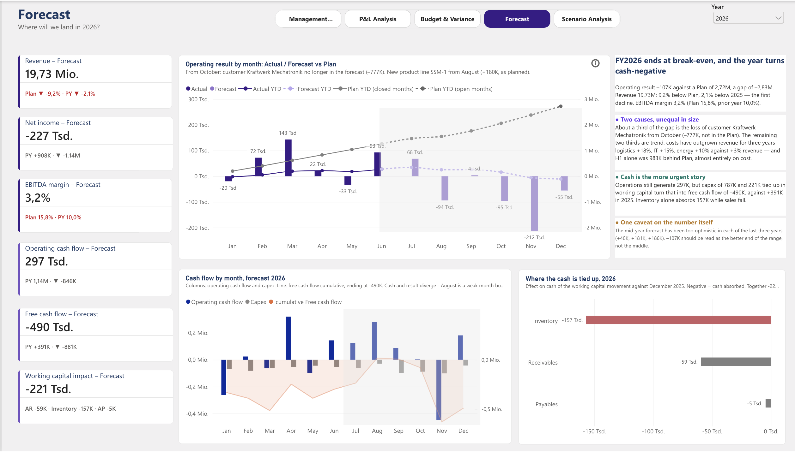
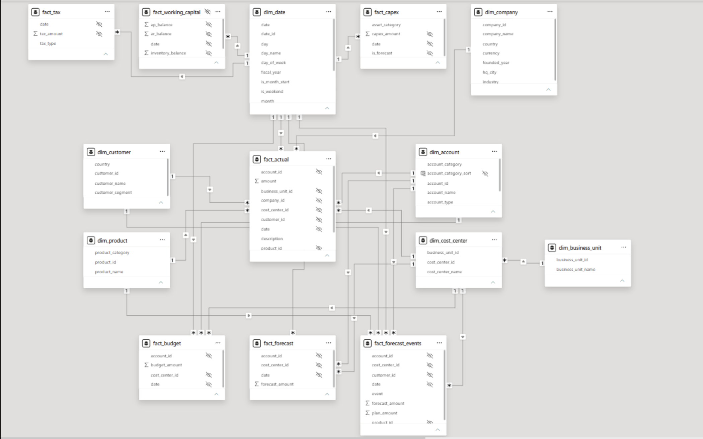

# AlpenTech Controlling – Power-BI-Finanzreporting

Ein fünfseitiger Controlling-Bericht in Power BI für die **AlpenTech GmbH**, einen fiktiven deutschen
Industrie-B2B-Hersteller. Abgedeckt sind die Geschäftsjahre 2023–2025 vollständig und 2026 als offenes Jahr
(Ist bis Juni, Forecast bis Dezember). Aufgebaut als Portfolioprojekt für Werkstudentenstellen im
**Controlling / FP&A**.


## Auf einen Blick

- **5 Berichtsseiten**, jede beantwortet eine Controlling-Frage – vom Management-Überblick bis zur Szenarioanalyse
- **Plan-Ist-Forecast-Vergleich** mit Abweichungsbrücken, Vorjahresvergleich und Forecast-Genauigkeit
- **Über die GuV hinaus:** Cash Conversion, Free Cashflow und Working Capital (DSO, DIO, Cash Conversion Cycle)
- **Sternschema** mit 7 Dimensionen und 7 Fakttabellen sowie einer entkoppelten Layouttabelle für die GuV
- **Dokumentierte Entscheidungen:** Jede nicht offensichtliche Definition (COGS, Forecast-Genauigkeit, Zielwerte)
  ist in [`docs/DECISIONS_LOG.md`](docs/DECISIONS_LOG.md) begründet
- **Werkzeuge:** Power BI Desktop, DAX, Power Query, TMDL · Python und JavaScript für die Daten

## Berichtsseiten

Der Bericht selbst ist auf Englisch; die Seitennamen sind daher im Original angegeben.

### 1. Management Cockpit – *Wie läuft das Geschäft?*

*(Screenshot ganz oben.)*

- Drei Kern-KPIs mit Status und Zielwert: **Jahresüberschuss**, **Cash Conversion Rate**, **Ist vs. Plan**
- EBITDA, Jahresüberschuss oder Umsatz je Monat gegen Plan, per Schaltfläche umschaltbar
- Brücke vom Umsatz zum Jahresüberschuss, Working-Capital-Karten (NWC, Forderungen, DIO, DSO) und eine Liste
  der Punkte, die Managementaufmerksamkeit brauchen

### 2. P&L Analysis – *Was treibt die Profitabilität?*


- GuV vom Umsatz bis zum Jahresüberschuss, nach Quartal und im Vorjahresvergleich
- EBITDA-Brücke 2024 → 2025: Das Umsatzwachstum von +875 Tsd. wurde von den COGS (−917 Tsd.) mehr als aufgezehrt
- Margenentwicklung über 12 Quartale und Betriebskosten nach Funktion

### 3. Budget & Variance – *Wo weichen wir vom Plan ab?*


- Planerreichung als Tacho und KPI-Karten mit Status (im Plan / hinter Plan)
- Plan-Ist-Vergleich nach Kontenkategorie und nach Kostenstelle
- EBITDA-Planbrücke, die größten ungünstigen Kostentreiber und priorisierte Maßnahmen

### 4. Forecast – *Wo landen wir 2026?*



- Hochrechnung zur Jahresmitte 2026: sechs abgeschlossene Monate plus sechs Monate Forecast, mit KPI-Karten
  gegen Plan und Vorjahr
- Betriebsergebnis je Monat, Ist und Forecast gegen Plan, mit kumulierten Linien
- Cashflow je Monat, kumulierter Free Cashflow und wo das Working Capital Liquidität bindet
- Kommentarfeld: die zwei Ursachen der Planlücke und warum der Forecast wahrscheinlich zu optimistisch ist

### 5. Scenario Analysis – *Was passiert, wenn sich Annahmen ändern?*


- Drei feste Szenarien (Base, Downside, Upside), jeweils mit Annahmen, die in den Daten verankert sind
- Kumulierter Free Cashflow je Szenario: Die abgeschlossenen Monate bleiben fix, nur Juli–Dezember verändert sich
- Szenariodetail vom Betriebsergebnis bis zum Free Cashflow und woher die Liquiditätsdifferenz kommt

## Zentrale Erkenntnisse

**Geschäftsjahr 2025**

- **Umsatz im Plan, Ergebnis nicht.** Der Umsatz von 20,16 Mio. € traf den Plan (+0,0 %) und wuchs um 4,5 %,
  das EBITDA lag aber 1,12 Mio. € unter Plan und 22,2 % unter Vorjahr. Die Lücke ist kostengetrieben.
- **Größter Treiber sind die Rohstoffe:** +490 Tsd. € über Plan, 43 % der ungünstigen Kostenabweichung.
- **Die Margen erodieren:** Die Bruttomarge sank von 50,9 % (2023) über 49,9 % auf 47,5 %. 2025 sank das
  Bruttoergebnis absolut, während der Umsatz wuchs.
- **Aus Gewinn wird keine Liquidität:** Aus 2,0 Mio. € EBITDA wurden 391 Tsd. € Free Cashflow. Das Net Working
  Capital wuchs um 19,7 % bei 4,5 % Umsatzwachstum; Kunden zahlen zehn Tage später als 2023.

**Ausblick 2026** (Stand 30. Juni 2026)

- **Forecast Betriebsergebnis −107 Tsd. € gegenüber einem Plan von +2,72 Mio. €** – der erste Verlust im Datensatz.
- **Rund ein Drittel der Lücke ist der Verlust des größten Kunden** (25,6 % des Umsatzes 2025, Nettoeffekt
  −777 Tsd. € ab Oktober). **Zwei Drittel sind der Kostentrend:** Logistik, IT und Energie wachsen seit drei
  Jahren schneller als der Umsatz.
- **Der Forecast ist wahrscheinlich zu optimistisch.** Die Hochrechnung zur Jahresmitte hat das Ergebnis in
  jedem der letzten drei Jahre überschätzt; −107 Tsd. € sind daher das bessere Ende der Bandbreite, nicht deren Mitte.

Ausführlich: [`docs/FORECAST_2026_SUMMARY.md`](docs/FORECAST_2026_SUMMARY.md)

## Datenmodell

Sternschema, eine Gesellschaft, Monats- und Transaktionsebene.

| Typ | Tabellen |
|---|---|
| Dimensionen | `dim_date`, `dim_company`, `dim_business_unit`, `dim_cost_center`, `dim_account`, `dim_customer`, `dim_product` |
| Fakten – GuV | `fact_actual` (Buchungen), `fact_budget`, `fact_forecast` (Kostenstelle × Konto × Monat) |
| Fakten – Liquidität & Steuern | `fact_working_capital`, `fact_capex`, `fact_tax` |
| Fakten – Forecast | `fact_forecast_events` (die zwei bekannten Ereignisse 2026) |
| Layout | `PnL_Layout`, eine entkoppelte Tabelle, die die GuV-Zeilen steuert |

**Vorzeichenkonvention:** Umsatz ist positiv, Kosten sind negativ, `SUM(amount)` ergibt also direkt das
Betriebsergebnis. Vorzeichen werden nur für die Anzeige innerhalb der Measures umgedreht, nie in Power Query.



Feldweise Referenz: [`docs/DATA_DICTIONARY.md`](docs/DATA_DICTIONARY.md)

## DAX im Detail

- **Abweichung in %, die nicht das Vorzeichen wechselt.** Jede Abweichung wird durch `ABS()` der Basis geteilt.
  Ohne das erscheinen Energiekosten, die 30,6 % über Plan liegen, als +30,6 % – eine Überschreitung, die günstig aussieht.
- **Ehrliche Forecast-Genauigkeit.** Der Forecast für Januar–Juni entspricht konstruktionsbedingt dem Ist. Der
  Forecast-Fehler wird daher nur für Juli–Dezember gemessen, über `KEEPFILTERS`, damit er sich weiterhin mit der
  Zeitauswahl des Nutzers schneidet. Für 2024 ändert das den Fehler von −8,5 % auf −18,9 %.
- **Kennzahlen über Konten hinweg.** Kostenquoten und Margen verwenden `REMOVEFILTERS ( dim_account )`, weil
  Zähler und Nenner auf verschiedenen Konten liegen. Ohne das ist die Kennzahl genau auf den Zeilen leer, auf
  denen sie gebraucht wird.
- **GuV mit Zwischensummen.** Bruttoergebnis, EBITDA und EBIT sind keine Konten. Eine entkoppelte Tabelle
  `PnL_Layout` liefert die Zeilen, ein `SWITCH`-Measure löst jede Zeile auf.
- **Sichere Massenumbenennung.** 34 Measures wurden per TMDL-Texttransformation umbenannt, die alle Verweise
  im selben Durchgang anpasste, und anschließend gegen alle 122 Feldverweise des Berichts geprüft.

## Designentscheidungen

Einige Beispiele aus [`docs/DECISIONS_LOG.md`](docs/DECISIONS_LOG.md):

- **COGS = direkte Produktionskosten ohne Abschreibungen.** Drei Definitionen wurden an den Daten durchgerechnet;
  nur bei dieser landet Bruttoergebnis minus Betriebsaufwand exakt beim EBITDA.
- **Cash-Conversion-Ziel 75 %, nicht 100 %.** Nach Steuern liegt die strukturelle Obergrenze bei 77–81 %. Ein
  Ziel von 100 % hielte den KPI dauerhaft rot und würde den Leser lehren, ihn zu ignorieren.
- **Kein geplanter Jahresüberschuss.** Der Plan umfasst nur GuV-Konten; der Jahresüberschuss wird daher mit dem
  Vorjahr und einem abgeleiteten Zielwert verglichen, nie als Planwert dargestellt.
- **Feste Szenarien statt freier Schieberegler.** Benannte Szenarien mit in den Daten verankerten Annahmen lassen
  sich vor dem Management begründen; beliebige Reglerkombinationen nicht.

## Aufbau des Repositorys

```
powerbi/       Power-BI-Bericht: .pbix zum Öffnen, PBIP-Projekt (Modell und DAX als Text)
data/          zentrale CSV-Tabellen, 2023–2025
docs/          Geschäftslogik, Datenkatalog, Entscheidungsprotokoll, Forecast-Methodik und -Zusammenfassung, Validierungsbericht
scripts/       Datengenerierung und Validierung
screenshots/   Berichtsseiten
```

## Öffnen

1. Repository herunterladen oder klonen.
2. `powerbi/AlpenTech_Controlling.pbix` in Power BI Desktop (Windows) öffnen.

Die Daten sind in die `.pbix` importiert; alle Seiten funktionieren ohne Aktualisierung.

Um das Modell ohne Power BI zu lesen, das PBIP-Projekt ansehen: Jede Tabelle, jede Beziehung und jedes
DAX-Measure liegt als Textdatei in
[`powerbi/AlpenTech_Controlling.SemanticModel/definition/`](powerbi/AlpenTech_Controlling.SemanticModel/definition/).

## Zu den Daten

Der Datensatz ist **synthetisch** und bewusst sauber: keine doppelten Schlüssel, keine fehlenden Werte, keine
gebrochenen Fremdschlüssel. Jede Abweichung zwischen Plan, Forecast und Ist ist ein bewusstes, erklärbares
Geschäftsszenario – so, wie es ein Controller untersuchen und berichten würde.

- `scripts/generate_dataset.py` erzeugt 2023–2025 (fester Seed, reproduzierbar)
- `scripts/validate_dataset.py` prüft Schlüssel, Vorzeichen und Szenarien → [`docs/data_validation_report.md`](docs/data_validation_report.md)
- Annahmen und Szenarien: [`docs/BUSINESS_LOGIC.md`](docs/BUSINESS_LOGIC.md) ·
  Forecast-Methodik: [`docs/FORECAST_METHODIK.md`](docs/FORECAST_METHODIK.md)

Working Capital, Investitionen und Steuern sind mit angenommenen Zahlungszielen aus der GuV abgeleitet: Die
*Trends* sind als real zu lesen, die *absoluten Niveaus* als illustrativ.

## Kontakt

Yuanyuan Zhang · [LinkedIn](https://www.linkedin.com/in/yuanyuan-zhang-876176242/)

MIT-Lizenz
